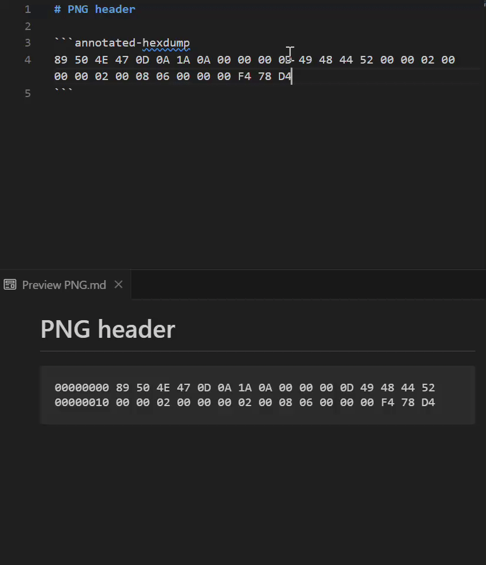

# md-annotated-hexdumps README

Adds support for annotated hexdumps, driven by the the [marked-annotated-hexdump](https://www.npmjs.com/package/marked-annotated-hexdump) library. This allows you to add highlighted regions to hexdumps, and control how they are displayed.



## Syntax

Simply create a markdown code block with the language set to `annotated-hexdump`, and use the following commands:

- `/highlight [0:3,6] /0` will highlight a bytes 0-3 inclusive and 6, using highlight color 0.
  There are 16 highlight colors.
- `/awidth 8` will display the addresses using 8 bytes instead of the default 4. You can use any value between 2 and 8.
- `/width 4` will display 4 bytes of data per line, instead of the default 16. You can use any value between 2 and 32.
- `/case upper` or `/case lower` can be used to control the case of the output hexdump. Defaults to uppercase.
- `/missing ?` will replace missing bytes with `??`. Defaults to whitespace.
- `/note /0 Header bytes` will place the note `Header bytes` after the hexdump, highlighted with color 0.

## Release Notes

### 1.0.0

Initial release of md-annotated-hexdumps.

## Contributing

### Manual release process

This process should not be required, as we automatically publish updates using github actions

```bash
npm ci
npm install -g @vscode/vsce
vsce package
```

### Automated release process

The automated release process can be run locally using:

```bash
export VSCE_PAT=...
export GITHUB_TOKEN=...
npm ci
npm run package
npx semantic-release --dry-run
```

Note that the Azure Devops token in VSCE_PAT is fairly short lived, and will need to be periodically refreshed.
